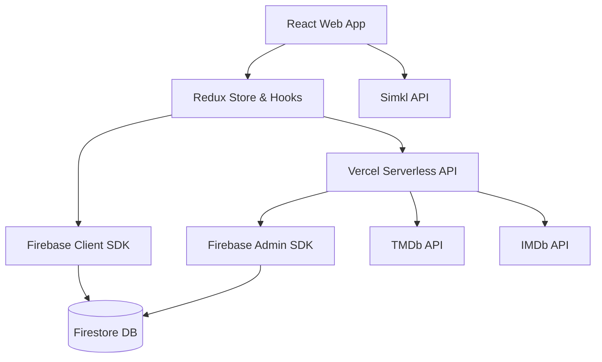
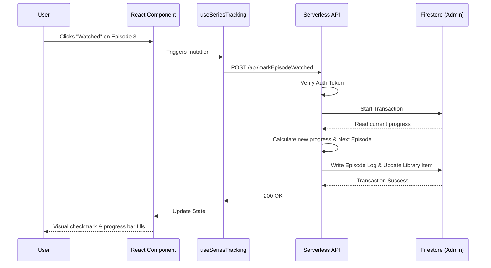

# 🎬 Strive

> **Your Personal Premium Streaming Dashboard & Media Library Manager**

Strive is a modern, feature-rich web application designed for movie and TV show enthusiasts. It provides a centralized, private, ad-free repository to discover content, manage custom watchlists, track TV episode progress, and synchronize data across platforms. Built with a full-stack approach using React, Firebase, Vercel Serverless Functions, and the TMDb API.


---

## 📑 Table of Contents
- [Overview](#-overview)
- [Features](#-features)
- [Tech Stack](#-tech-stack)
- [Architecture](#-architecture)
- [Folder Structure](#-folder-structure)
- [Installation & Setup](#-installation--setup)
- [Environment Variables](#-environment-variables)
- [Scripts](#-scripts)
- [Configuration](#-configuration)
- [API Integrations](#-api-integrations)
- [Project Workflow](#-project-workflow)
- [State Management](#-state-management)
- [Performance Optimizations](#-performance-optimizations)
- [Security](#-security)
- [Deployment](#-deployment)
- [Future Improvements](#-future-improvements)
- [Contributing](#-contributing)
- [License](#-license)

---

## 📖 Overview

**What problem this solves:** Managing a personal media catalog across various streaming services is fragmented. Users find it difficult to track what they want to watch, where they left off in a TV series, and maintain a unified library. Standard applications are often commercialized, lack custom grouping, or lock in user data.

**Why it exists:** Strive was built to provide a clean, unified, ad-free media library manager. It prioritizes data portability (CSV imports/exports), detailed TV show tracking (episode-level matrices), and local-first responsiveness.

**Who it is for:** Cinephiles, series binge-watchers, power users who prefer CSV management, and Simkl users looking for a private, synchronized library dashboard.

---

## ✨ Features

### 🔐 Authentication & Security
- **Secure Sign-in:** Powered by Firebase Authentication.
- **Private Workspaces:** Each user gets an isolated Firestore environment for their library and settings.
- **Serverless Data Protection:** Critical operations (like TV progress tracking) are locked down and handled securely via Vercel Serverless API using Firebase Admin credentials.

### 📚 Advanced Library Management
- **Centralized Catalog:** Save movies and TV shows to a primary library.
- **Custom Lists:** Create, name, pin, and manage unlimited personal lists (e.g., "Favorite Sci-Fi", "Weekend Binges").
- **Watch Status Tracking:** Mark items as "Plan to Watch", "Watching", "Completed", or "Dropped".

### 📺 TV Show Tracking
- **Episode Matrix:** A visual grid dashboard of seasons and episodes.
- **Granular Logging:** Check off individual episodes and track watch history.
- **Auto-Calculated Progress:** Automatically computes completion percentages, aired episodes versus watched, and the "Next to Watch" episode.

### 🔄 Data Portability (Import/Export)
- **CSV Export:** Download any list as a portable CSV file.
- **Smart CSV Import:** Upload CSVs with automatic TMDb/IMDb matching, fallback manual searching, and batch processing.

### 🎥 Discovery & Search
- **Dynamic Feeds:** Browse Now Playing, Popular, Top Rated, and Upcoming content.
- **Universal Debounced Search:** Real-time multi-category search spanning movies and TV series.
- **Detailed Media Views:** High-quality posters, backdrops, synopses, cast listings, and integrated trailers.

### 🔌 External Integrations
- **Simkl Synchronization:** Connect a Simkl account to sync scrobbles and watch history automatically.
- **IMDb Ratings Enrichment:** Fuses TMDb metadata with highly accurate IMDb audience scores.

### ⚡ Responsive & Dynamic UI
- **Glassmorphism & Animations:** Fluid page transitions and micro-interactions powered by Framer Motion.
- **Responsive Layouts:** Tailored experiences for mobile, tablet, and desktop using Tailwind CSS.
- **Integrated Video Player:** A built-in player interface with multi-server fallback support.

---

## 🛠 Tech Stack

| Category | Technology |
| :--- | :--- |
| **Frontend** | React 19, Vite |
| **Routing** | React Router DOM |
| **State Management** | Redux Toolkit (Slices, Thunks) |
| **Styling** | Tailwind CSS v4, Vanilla CSS |
| **Animation** | Framer Motion |
| **Backend API** | Node.js, Vercel Serverless Functions |
| **Database** | Firebase Firestore (NoSQL) |
| **Authentication** | Firebase Auth |
| **External APIs** | TMDb, IMDb, Simkl |
| **Utilities** | PapaParse (CSV), Busboy (Multipart forms), Axios |

---

## 🏗 Architecture

Strive follows a clean, tiered architecture where data flows unidirectionally from services to UI components.

### System Architecture Flowchart



### Component Layers
1. **UI Layer:** Pages, Modals, Shared Panels (BottomNav, EpisodeMatrixView).
2. **State Layer:** Redux Store (`userSlice`, `listsSlice`, `simklSlice`, etc.).
3. **Business Logic:** Custom Hooks (`useSeriesTracking`, `useImdbRating`) and Adapters.
4. **Data Layer:** Firestore Client SDK for direct client-authorized reads/writes.
5. **Infrastructure Layer:** Vercel Serverless Functions handling privileged operations (e.g., episode watch logs, CSV batch parsing) via the Firebase Admin SDK.

---

## 📁 Folder Structure

```text
strive/
├── api/                   # Vercel Serverless Functions (Backend)
│   ├── _lib/              # Shared backend utilities, middleware, and adapters
│   ├── lists/             # Endpoints for CSV import/export & enrichment
│   ├── movie/             # Endpoints for movie details
│   ├── tv/                # Endpoints for TV details, episodes, videos
│   └── markEpisodeWatched.js # Critical endpoint for TV progress tracking
├── docs/                  # Comprehensive technical documentation & guides
├── public/                # Static public assets
├── scripts/               # Maintenance scripts (backfill, database repair)
└── src/                   # React Frontend Source
    ├── assets/            # Local images and icons
    ├── components/        # UI Components (auth, layout, library, lists, media)
    ├── domain/            # Domain models and business logic adapters
    ├── hooks/             # Custom React Hooks for state and data fetching
    ├── js/                # Vanilla JavaScript utilities (e.g., player logic)
    ├── services/          # Services for Firestore CRUD, TMDb, IMDb, Simkl
    ├── styles/            # Global and component-specific CSS
    ├── util/              # Utilities (Redux store setup, Firebase init)
    ├── App.jsx            # Main App entry and global event listeners
    └── main.jsx           # React DOM render entry
```

---

## 🚀 Installation & Setup

**1. Clone the repository**
```bash
git clone https://github.com/CoffeePatch/StrIve.git
cd strive
```

**2. Install dependencies**
```bash
npm install
```

**3. Configure Environment Variables**
Copy `.env.example` to `.env` and populate the required keys (see [Environment Variables](#-environment-variables)).

**4. Start the development server**
```bash
npm run dev
```
The app will be available at `http://localhost:5173`.

**5. Build for production**
```bash
npm run build
```

---

## 🔐 Environment Variables

Create a `.env` or `.env.local` file with the following variables. **Never commit your actual `.env` file containing secrets.**

| Variable | Purpose |
| :--- | :--- |
| `VITE_FIREBASE_API_KEY` | Firebase Client API Key. |
| `VITE_FIREBASE_AUTH_DOMAIN` | Firebase Client Auth Domain. |
| `VITE_FIREBASE_PROJECT_ID` | Firebase Project ID. |
| `VITE_FIREBASE_STORAGE_BUCKET` | Firebase Storage Bucket. |
| `VITE_FIREBASE_MESSAGING_SENDER_ID`| Firebase Messaging Sender ID. |
| `VITE_FIREBASE_APP_ID` | Firebase App ID. |
| `TMDB_API_KEY` | Used by serverless API to query TMDb. |
| `TMDB_READ_ACCESS_TOKEN` | Used by serverless API for authenticated TMDb requests. |
| `FIREBASE_PROJECT_ID` | Used by Firebase Admin SDK in serverless API. |
| `FIREBASE_CLIENT_EMAIL` | Service Account Email for Firebase Admin SDK. |
| `FIREBASE_PRIVATE_KEY` | Service Account Private Key for Firebase Admin SDK. |
| `VITE_USE_FIRESTORE_EMULATOR` | (Optional) Set to `true` to use local emulator. |

---

## 📜 Scripts

| Script | Command | Description |
| :--- | :--- | :--- |
| **dev** | `vite` | Starts the Vite development server. |
| **build** | `vite build` | Compiles and bundles the application for production. |
| **lint** | `eslint .` | Runs ESLint to check for code quality and styling issues. |
| **preview** | `vite preview` | Serves the production build locally for testing. |

---

## ⚙️ Configuration

- **`vite.config.js`:** Configures the Vite bundler, React plugins, Tailwind CSS integration, bundle visualizer, and sets up local API proxying (`/api` to `localhost:3000`).
- **`vercel.json`:** Defines the Vercel deployment configuration, routing rules for single-page applications, serverless API rewrites, and CORS headers.
- **`firebase.json`:** Outlines Firebase Hosting, Functions, and Emulator settings. Points to Firestore security rules (`firestore.rules`) and indexes (`firestore.indexes.json`).
- **`firestore.rules`:** A comprehensive security model that restricts client access. Ensures users only read/write their own library documents while explicitly denying client writes to critical `episode_states` and `series_progress` paths (enforcing server-side validation).
- **`eslint.config.js`:** Uses the flat config format to enforce modern JavaScript and React Hooks best practices.

---

## 🌐 API Integrations

### TMDb (The Movie Database)
- **Role:** Primary source of truth for media catalogs, searches, posters, and cast lists.
- **Integration:** Accessed securely via Vercel serverless proxy endpoints (`/api/tmdb`, `/api/movie/details`, `/api/tv/details`).
- **Handling:** Implements rate limiting protection, caching, and concurrent request limits (using `pLimit`).

### IMDb (Internet Movie Database)
- **Role:** Enriches library items with high-quality audience scores.
- **Integration:** Mapped via TMDb external IDs and fetched via a custom/fallback API endpoint.
- **Handling:** Ratings are locally cached in Firestore (`imdb_cache/{tmdbId}`) to drastically reduce API hits and improve load times.

### Simkl
- **Role:** Provides 2-way watch history synchronization and active playback scrobbling.
- **Integration:** OAuth-based authentication, background polling for sync activities, and batch updating library statuses based on external watch events.

---

## 🔄 Project Workflow

How data moves during a core user action (e.g., Marking a TV episode as watched):



---

## 🗃 State Management

Strive relies on a robust combination of local UI state and global Redux slices:

- **Redux Toolkit (`appStore.js`):**
  - `userSlice`: Manages active user session and profile data.
  - `listsSlice`: Caches custom lists, active list items, and handles batch thunks for list additions/deletions.
  - `moviesSlice` / `tvShowsSlice`: Caches discovery feeds (Popular, Top Rated, Now Playing) to prevent redundant API fetches on route changes.
  - `simklSlice`: Manages Simkl authentication status, sync history, and background scrobble states.
- **React Context / Local State:** Used for ephemeral UI states like modal visibility, search debouncing, and filter selections.
- **Real-time Listeners:** Custom hooks (e.g., `useEpisodeStates`, `useSeriesProgress`) establish direct `onSnapshot` connections to Firestore, bypassing Redux for instantaneous updates when data changes server-side.

---

## 🚀 Performance Optimizations

Strive is engineered for speed and low database reads to stay within Firebase hobby tier limits:

- **Document Caching:** IMDb ratings are cached in an `imdb_cache` collection, eliminating repetitive external API calls across users.
- **Debounced Input:** Search fields use a 500ms debounce (`useSearch` hook) to prevent spamming the TMDb API.
- **Memoization:** Heavy list filtering and sorting calculations utilize `useMemo` to prevent UI blocking during renders.
- **Single Source of Truth:** The database avoids data duplication. A single `library_items` document tracks all list memberships via arrays, preventing multiple document reads.
- **Serverless Transactions:** Complex operations involving multiple document updates (like TV progress tracking) are processed in bulk server-side, reducing client-side processing and network roundtrips.
- **Batch Processing:** CSV imports chunk and process requests concurrently (e.g., max 10 concurrent TMDb requests) to avoid timeouts and rate limits.

---

## 🛡 Security

- **Authentication:** All private routes are guarded by a `ProtectedRoute` component that forces Firebase authentication.
- **Authorization:** Firestore Security Rules strictly enforce that `request.auth.uid == uid` for all read/write operations on user data.
- **Protected Database Paths:** Sensitive collections like `episode_states` and `series_progress` completely reject client writes. They can only be modified by the serverless API using a verified Firebase Admin token.
- **API Security:** The Vercel API validates Firebase ID tokens via custom middleware (`authMiddleware.js`) before executing any mutative actions.
- **Secret Management:** API keys for TMDb and Firebase Admin are stored exclusively in backend environment variables and are never exposed to the client bundle.

---

## 🚢 Deployment

Strive is designed for a split deployment model (though primarily hosted on Vercel):

1. **Frontend Hosting & Serverless API:** Deployed on **Vercel**. 
   - Vercel automatically builds the Vite app and serves the `/api` directory as Serverless Functions.
   - `vercel.json` configures the necessary rewrites and CORS headers.
2. **Database & Auth:** Hosted on **Firebase**. 
   - Firestore holds the NoSQL database.
   - Firebase Auth handles identity management.

**Production Workflow:**
Pushing to the `main` branch triggers an automatic build and deployment pipeline on Vercel.

---

## 🔮 Future Improvements

Based on the current architecture, potential future enhancements could include:
- **AI-Powered Recommendations:** Generating personalized suggestions based on library contents and watch history.
- **Social Features:** Public user profiles and the ability to share or clone custom lists.
- **Enhanced Data Visualizations:** A dashboard for watching habits and statistics (e.g., time watched per genre).
- **PWA Support:** Adding a web manifest and service workers for native-like offline capabilities.

*(Note: These are future ideas and are not currently implemented.)*

---

## 🤝 Contributing

Contributions are welcome! If you have suggestions for improvements or want to add new features:

1. **Fork** the repository.
2. Create your feature branch: `git checkout -b feature/AmazingFeature`
3. **Commit** your changes: `git commit -m 'Add some AmazingFeature'`
4. **Push** to the branch: `git push origin feature/AmazingFeature`
5. Open a **Pull Request**.

---

## 📄 License

This project is licensed under the MIT License. See the `LICENSE` file for details.

---

<div align="center">
  Built with ❤️ for Movie and TV Show enthusiasts.
</div>
